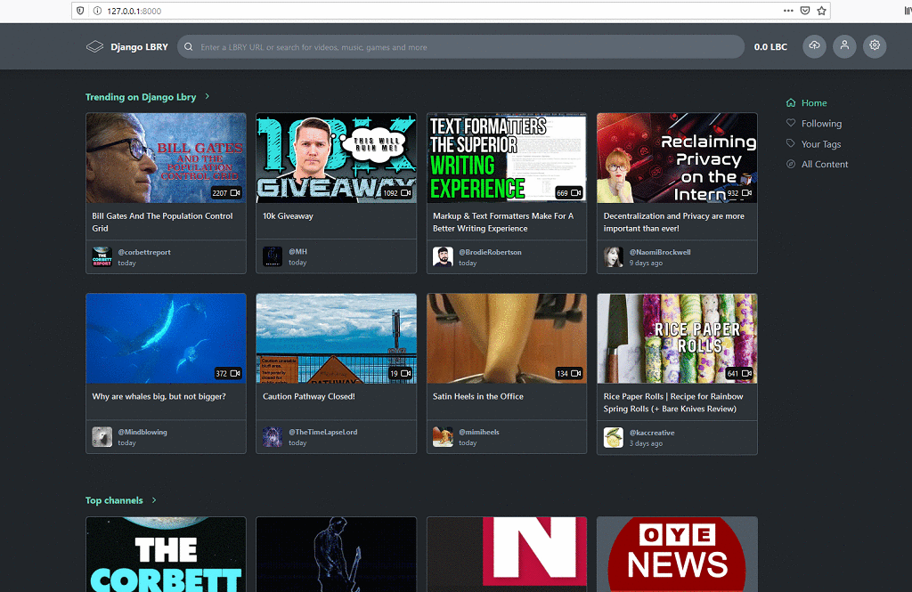

# django_lbry 

This is a Django Framework starter project for building web apps on top of the LBRY SDK.   
   
   * Python 3.7+ (https://www.python.org)
   * Django Framework (https://www.djangoproject.com/)
   * LBRY-SDK (https://github.com/lbryio/lbry-sdk)
   * LBRY-desktop UI (https://github.com/lbryio/lbry-desktop/tree/master/ui)
   
   
    
## Running

  First install lbry-sdk and start the api on your environment [see](https://github.com/lbryio/lbry-sdk/blob/master/INSTALL.md)
  (or just keep an LBRY instance open).
  
   clone this repository
  `git clone https://github.com/lpessin/django_lbry/`  
  
  
  Install other requirements with `pip install -r requirements.txt`    
  
  
  Run: `python manage.py runserver`
  

## Modifying
      
  The `sdk.py` file wraps the LBRY-SDK API and serves views.py with data.    
   
  `base` template holds `pages` who holds `components`.     
     
   URLs are following the same patterns as lbry.tv.   
   
   Models ands Users auths to be added.

## Contributing

   Contributions to this project are welcome. Send us a message or check for open issues.

## License

  This project is MIT licensed. For the full license, see [LICENSE](https://github.com/lpessin/django_lbry/blob/master/LICENSE).

## Contact
   
  luizpessin@hotmail.com
    
## Additional Info and Links

  People are discussing this and other LBRY community projects on Lbry-chat: https://discord.gg/HVgVXPK
  
  Lbry links:
  https://lbry.tv  
  https://github.com/lbryio

   * This is a community project.
